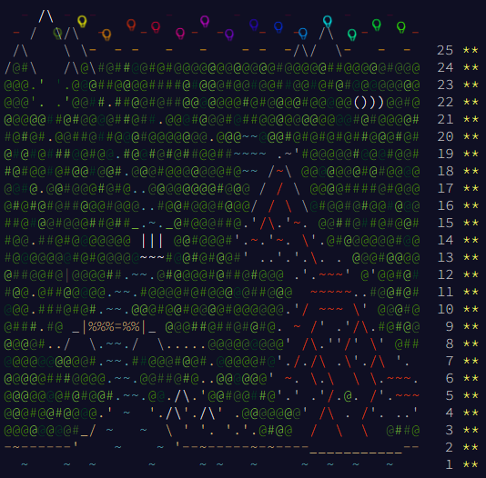

# 2022 Advent of Code challenges

- [Day 1](https://adventofcode.com/2022/day/1): java
- [Day 2](https://adventofcode.com/2022/day/2): C
- [Day 3](https://adventofcode.com/2022/day/3): Python
- [Day 4](https://adventofcode.com/2022/day/4): C++
- [Day 5](https://adventofcode.com/2022/day/5): VB.NET
- [Day 6](https://adventofcode.com/2022/day/6): C#
- [Day 7](https://adventofcode.com/2022/day/7): PHP
- [Day 8](https://adventofcode.com/2022/day/8): JavaScript
- [Day 9](https://adventofcode.com/2022/day/9): Bash
- [Day 10](https://adventofcode.com/2022/day/10): Haskell
- [Day 11](https://adventofcode.com/2022/day/11): Go
- [Day 12](https://adventofcode.com/2022/day/12): Delphi/Pascal
- [Day 13](https://adventofcode.com/2022/day/13): Ruby
- [Day 14](https://adventofcode.com/2022/day/14): FoxPro
- [Day 15](https://adventofcode.com/2022/day/15): Perl
- [Day 16](https://adventofcode.com/2022/day/16): Rust
- [Day 17](https://adventofcode.com/2022/day/17): Erlang
- [Day 18](https://adventofcode.com/2022/day/18): Clojure
- [Day 19](https://adventofcode.com/2022/day/19): OCAML
- [Day 20](https://adventofcode.com/2022/day/20): F#
- [Day 21](https://adventofcode.com/2022/day/21): Scala
- [Day 22](https://adventofcode.com/2022/day/22): Lisp
- [Day 23](https://adventofcode.com/2022/day/23): Groovy
- [Day 24](https://adventofcode.com/2022/day/24): Ada
- [Day 25](https://adventofcode.com/2022/day/25): PowerShell

